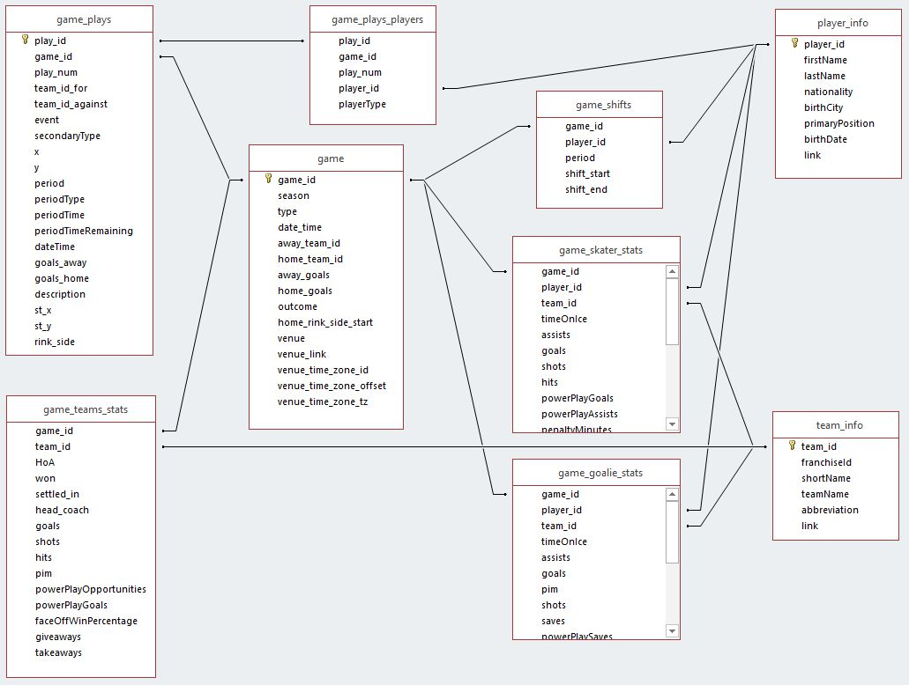

# Jupyter Workshop

This is a collection of Jupyter Notebooks for [Matt Eland](https://MattEland.dev)'s **Beginning Data Analysis and Machine Learning with Jupyter Notebooks** tutorial workshop first debuted at [AI Con USA](https://aiconusa.techwell.com/)

## Speaker Bio

**Matt Eland** - AI Specialist @ Leading EDJE

Matt Eland is a software engineering leader and data scientist who has served as a senior engineer, software engineering manager, professional programming instructor, and has helped build enterprise-level software at a variety of organizations before distinguishing himself as a Microsoft MVP in Artificial Intelligence. Matt is an AI Specialist at Leading EDJE, is the author of Refactoring with C# and the upcoming book, Data Science in .NET with Polyglot Notebooks. Matt has also authored a LinkedIn Learning course on Computer Vision on Azure relating to the Azure AI Engineer associate certification which he holds along with the Azure Data Scientist associate certification. Matt organizes the Central Ohio .NET Developer Groups and helps organize several conferences in the midwestern United States. Matt is finalizing his master's degree in data analytics and occasionally sleeps as well.

## Workshop Abstract

In this beginner-friendly workshop you'll see how you can get started with data analytics and data science using Jupyter Notebooks. Matt will start with the basics of notebooks and then move on to using Python, Pandas, and NumPy to perform basic exploratory data analysis. See how you can use Plotly Express to create interactive charts and visuals with only a minimal amount of code. Once you've grasped the basics of understanding and visualizing the data Matt will move on to machine learning with SciKit-Learn as you train and evaluate predictive regression and classification models. The tutorial will cover common concerns in machine learning such as biases in data, the importance of data cleaning and feature engineering, comparing different models, and model drift. Finally, close with an exploration of the myriad of other ways you and your team can use notebooks to conduct repeatable data science experiments, mix together code and markdown, and even extend Jupyter Notebooks to other languages. You'll leave with a deeper set of tools that you can use to analyze data and make predictions with trained machine learning models.

## Pre-requisites

In order to follow along with the workshop, you will need to install the following cross-platform tools:

- [Anaconda](https://www.anaconda.com/download/success) as a self-contained Python environment complete with data science libraries pre-installed
- [Clone or download this repository](https://github.com/IntegerMan/JupyterWorkshop) in order to follow along
- [Install VS Code](https://code.visualstudio.com/) as our editor of choice
- [Install the Juypter Extension for VS Code](https://marketplace.visualstudio.com/items?itemName=ms-toolsai.jupyter) this should automatically prompt you to install on opening the workspace in VS Code

If you have issues installing these pre-requisites in advance, please reach out to me at *matt@mattondatascience.com*.

You may also be able to follow along with an active internet connection and a cloud-hosted notebook on [Anaconda Cloud](https://anaconda.cloud/) or other services.

I'd also recommend you run the notebook cells at the beginning of the [02_DataDownload.ipynb](Notebooks/02_DataDownload.ipynb) notebook to download and extract data files for the workshop with a reliable internet connection. Alternatively, you can download the data manually and extract it into the `Data` directory.

## Data Source

The workshop will analyze data from the [NHL Game Data](https://www.kaggle.com/datasets/martinellis/nhl-game-data) dataset on [Kaggle](https://Kaggle.com) uploaded by Martin Ellis in 2021.

## Agenda

We will be focusing on the following major areas:

- **Notebooks 101** - Focusing on writing Python code in an interactive notebook environment and getting used to Jupyter Notebooks.
- **Exploratory Data Analysis** - We'll be looking over a tabular dataset with Pandas and NumPy to see how DataFrames work.
- **Data Visualization** - We'll use Plotly Express to visualize our dataset using several common data visualization methods.
- **Data Cleaning and Feature Engineering** - We'll use Pandas and NumPy to transform our dataset and address data cleanliness issues in our data.
- **Machine Learning with SciKit-Learn** - We'll perform a classification experiment and a regression experiment on our dataset
- **Closing thoughts** - We'll close by talking about fairness and transparency in models, ethical issues in model training, data drift and MlOps, and other technologies that use Jupyter Notebooks as a foundation

